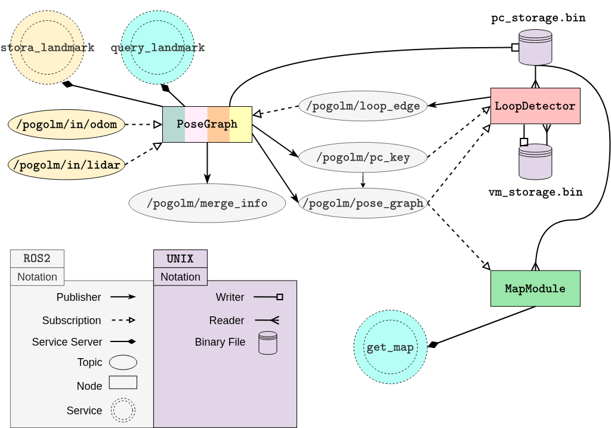

# POGOLM 

POGOLM (**PO**se **G**raph **O**ptimization and **L**andmark **M**anagement) is a C++/ROS 2 interface that adds **real-time loop detection** and **pose graph optimization** to an existing incremental SLAM/odometry pipeline-targeting **resource-constrained mobile robots**. It also provides a TF2-independent transform handling strategy so that **pose corrections for past timestamps remain consistent**, and it can **jointly optimize landmarks** with the robot trajectory and expose them via query APIs.

---

## Why POGOLM?

Incremental odometry accumulates drift. POGOLM reduces long-term (global) drift by:
- detecting loop closures online,
- inserting loop constraints into a pose graph,
- optimizing the full graph (robot poses + optional landmarks),
- and exposing a globally consistent “generic map” output that downstream modules can consume.

---

## System overview

An overview diagram is provided here:

 


---

## Architecture

POGOLM is implemented as **three composable ROS 2 nodes** that together cover the internal modules:

- **PoseGraph**: point cloud preprocessing + keyframe selection + pose graph construction + pose graph optimization + landmark storage/query
- **LoopDetector**: loop detection and verification pipeline (descriptor matching + registration)
- **MapModule**: serves a generic, globally consistent map representation on request

POGOLM can be used in two ways:
1. **Standalone process** (run the nodes via launch file; external communication via topics/services).
2. **Embedded/API mode** (link against the `pogolm_api` library and attach nodes to your executor; allows direct synchronous member-function calls in addition to ROS interfaces).

---

## ROS 2 node summary

### 1) `PoseGraph`
**Responsibilities**
- Builds and maintains the pose graph (robot poses + optional landmarks).
- Samples incoming sensor streams into **keyframes** based on configurable criteria.
- Triggers optimization when loop edges arrive.
- Preprocesses and stores point clouds into binary storage for reuse by other nodes.
- Provides landmark storage and query services (and/or API calls).

**Inputs**
- `/pogolm/lidar_in` (`sensor_msgs/msg/PointCloud2`): LiDAR point clouds (ordered or unordered). Points beyond a configured range are filtered.
- `/pogolm/odom_in` (`geometry_msgs/msg/Odometry`): odometry poses used to create successive constraints.
  - Optional: use covariance from messages if `dynamic_pose_cov` is enabled; otherwise a static noise model is used.

**Optimization**
- Uses GTSAM factor graph types such as priors, between-factors for odometry edges, and landmark-related factors.
- Runs only **one optimization at a time** by delegating optimization work to a dedicated thread and buffering loop candidates.

**Frame transforms**
- Maintains a consistent transform update strategy independent of TF2 so that “historical” pose updates remain coherent after each optimization.

---

### 2) `LoopDetector`
**Responsibilities**
- Detects loop closure candidates for each new keyframe and verifies them before sending loop edges to `PoseGraph`.

**Pipeline (high-level)**
1. **Descriptor matching** (ScanContext++): compute similarity and an initial yaw/shift estimate.
2. **Global registration refinement** (KISS-Matcher): improves the transform estimate.
3. **ICP refinement** (small_gicp): final alignment.
4. A candidate is accepted if the registration converges as configured; accepted loop edges are published to `PoseGraph`.

**Performance considerations**
- Operates with a **near/far history split** and parallel sub-threads to reduce runtime.
- Enforces a **real-time time budget** per keyframe; stops evaluating more candidates if it would exceed the limit.

---

### 3) `MapModule`
**Responsibilities**
- Answers map requests while keeping the representation **generic** to stay compatible with different downstream mapping stacks.

**Output**
- A “generic map” consisting of:
  - the set of keyframe point clouds (full resolution),
  - the corresponding globally consistent keyframe poses,
  - optional globally consistent landmarks.

Downstream consumers can:
- build a point-cloud map (transform & concatenate),
- build landmark-only maps,
- or generate meshes with external reconstruction tools.

---

## Landmark usage workflow

POGOLM can store landmarks as pose-graph variables and optimize them jointly with robot poses. It intentionally **does not do data association** for you, but it supports your pipeline with **spatial queries** (range / kNN) to retrieve nearby landmarks as candidates for association.

A concrete reference implementation of the workflow described in the thesis is available here:
- `https://github.com/iamdavidson/pogolm_landmark_usage.git`

---

## Requirements

### Platform
- Ubuntu 22.04
- ROS2 (this project was built and tested on ROS2 Jazzy)

### Core dependencies
- **GTSAM 4.2**  
  - Prefer installing via ROS packages if available `ros-<distro>-gtsam`.
- **small_gicp** (ICP refinement)
- **ROBIN** (dependency of KISS-Matcher)
- **KISS-Matcher** (global registration refinement; depends on ROBIN)
- **CMake policy CMP0144**  
  - This repository expects `cmake_policy(SET CMP0144 NEW)`. If your toolchain is older or conflicts, you can switch the policy in `CMakeLists.txt` as a fallback.

### Libraries used by this repository
- PCL (io, filters, segmentation)
- OpenCV
- Eigen3
- yaml-cpp
- FLANN
- Zstandard (**zstd**) (required for linking; package often named `libzstd-dev`)
- small_gicp (third-party)
- ROBIN (third-party)
- KISS-Matcher (third-party, depends on ROBIN)
- (Optional) RViz factor-graph plugins for visualization


## Installation

### 1) Source ROS 2

```bash
source /opt/ros/<distro>/setup.bash
````

### 2) Install system dependencies

```bash
sudo apt-get update
sudo apt-get install -y \
  git cmake build-essential pkg-config \
  python3-pip python3-venv \
  python3-colcon-common-extensions python3-rosdep python3-vcstool \
  libeigen3-dev \
  libboost-all-dev \
  libtbb-dev \
  libyaml-cpp-dev \
  libopencv-dev \
  libpcl-dev \
  libflann-dev \
  libnanoflann-dev \
  libomp-dev \
  libzstd-dev

sudo rosdep init
rosdep update
```

> Installing GTSAM via apt (recommended):

```bash
sudo apt-get install -y ros-<distro>-gtsam
```

### 3) Clone repositories into your ROS 2 workspace

```bash
cd ~/ros2_ws/src

# POGOLM 
git clone --recurse-submodules https://github.com/iamdavidson/pogolm.git

# Required: message/service definitions
git clone https://github.com/iamdavidson/pogolm_interfaces.git

# Optional: RViz visualization plugins
git clone https://github.com/iamdavidson/rviz_factor_graph_plugins.git
```

### 4) Build third-party libraries (if not already available)

```bash
mkdir -p ~/third_party
```

<details open>
<summary><b>small_gicp</b></summary>

```bash
cd ~/third_party
git clone https://github.com/koide3/small_gicp.git
cd small_gicp

cmake -S . -B build \
  -DCMAKE_BUILD_TYPE=Release \
  -DCMAKE_POSITION_INDEPENDENT_CODE=ON \
  -DBUILD_SHARED_LIBS=ON

cmake --build build -j"$(nproc)"
sudo cmake --install build
sudo ldconfig
```

</details>

<details>
<summary><b>GTSAM</b> (only if you don't use <code>ros-*-gtsam</code>)</summary>

```bash
cd ~/third_party
git clone https://github.com/borglab/gtsam.git
cd gtsam

cmake -S . -B build \
  -DCMAKE_BUILD_TYPE=Release \
  -DGTSAM_BUILD_TESTS=OFF \
  -DGTSAM_BUILD_EXAMPLES=OFF \
  -DGTSAM_BUILD_UNSTABLE=ON \
  -DGTSAM_USE_TBB=ON

cmake --build build -j"$(nproc)"
sudo cmake --install build
sudo ldconfig
```

</details>

<details>
<summary><b>ROBIN</b></summary>

```bash
cd ~/third_party
git clone https://github.com/MIT-SPARK/ROBIN.git
cd ROBIN

cmake -S . -B build \
  -DCMAKE_BUILD_TYPE=Release \
  -DCMAKE_POSITION_INDEPENDENT_CODE=ON \
  -DBUILD_SHARED_LIBS=ON

cmake --build build -j"$(nproc)"
sudo cmake --install build
sudo ldconfig
```

</details>

<details>
<summary><b>KISS-Matcher</b></summary>

```bash
cd ~/third_party
git clone https://github.com/MIT-SPARK/KISS-Matcher.git
cd KISS-Matcher

cmake -S cpp/kiss_matcher -B cpp/kiss_matcher/build \
  -DCMAKE_BUILD_TYPE=Release \
  -DCMAKE_POSITION_INDEPENDENT_CODE=ON \
  -DBUILD_SHARED_LIBS=ON

cmake --build cpp/kiss_matcher/build -j"$(nproc)"
sudo cmake --install cpp/kiss_matcher/build
sudo cmake --install cpp/kiss_matcher/build/_deps/robin-build 

sudo ldconfig
```

</details>

### 5) Install ROS dependencies via rosdep

```bash
cd ~/ros2_ws
rosdep install --from-paths src --ignore-src -r -y
```

### 6) Build

```bash
cd ~/ros2_ws
rm -rf build install log
colcon build --cmake-args -DCMAKE_BUILD_TYPE=Release
source install/setup.bash
```

---


### RViz Factor Graph Plugins (optional)

If you cloned and built `rviz_factor_graph_plugins`, you can visualize the pose graph in RViz.

#### Usage
1. Build your workspace and source it
2. Run `rviz2` and add the display type `FactorGraph`
3. Select `/pogolm/pose_graph` as the topic


## Running POGOLM

POGOLM supports two integration styles:

- **Standalone mode (ROS 2 nodes + launch files)**: run the nodes as regular ROS 2 processes and communicate via topics/services.
- **API mode (embedded)**: link against the POGOLM API and run it inside your own process/executor, with direct function calls in addition to ROS interfaces.

### Standalone mode (launch)

After building, run the included launch file:

```bash
ros2 launch pogolm pgo_launch_components.launch.py
```

### API mode (embedded)

In **API mode**, you integrate POGOLM as a library into your own ROS 2 application. This is useful when you want
tight control over threading/executors, or when you prefer synchronous member-function calls over topic/service wiring.

#### Minimal reference

A small reference implementation is provided in:

* `src/test_node` (shows how to construct and use the API inside a node)

You can either:

1. **Run the test node directly** 
```bash
ros2 run pogolm test_node
```
2. **Copy the integration pattern** into your own project and link/include POGOLM as a dependency.

#### Example projects using API mode

For a complete example of embedding POGOLM into a external project, see:

* `https://github.com/iamdavidson/pogolm_landmark_usage.git`

This repo demonstrates how to include POGOLM in your own packages, configure it, and use the landmark query/management workflow in practice.

### Inputs you must provide

* Publish LiDAR point clouds to: `/pogolm/lidar_in`
* Publish odometry to: `/pogolm/odom_in`

### Optional visualization

If you installed `rviz_factor_graph_plugins`, you can visualize:

* pose graph structure,
* constraints,
* landmarks

---

## Configuration

POGOLM is configured via YAML in `config/` (standalone mode) or via a parameter object / YAML (API mode).
Typical parameters include:

* keyframe selection thresholds (distance/angle/time),
* loop detection settings (min loop length, descriptor thresholds, time budget),
* registration tuning (ICP settings, global registration settings),
* landmark query settings.

---

## Troubleshooting

### CMake policy / toolchain mismatch

If configuration fails due to CMP0144:

* update CMake, or
* adjust `cmake_policy(SET CMP0144 ...)` in the top-level `CMakeLists.txt`.

### Zstd not found / linking fails

Make sure:

```bash
sudo apt-get install -y libzstd-dev pkg-config
```

### GTSAM version mismatch

If you see ABI or API mismatches:

* prefer the ROS package for your distro (`ros-<distro>-gtsam`)
